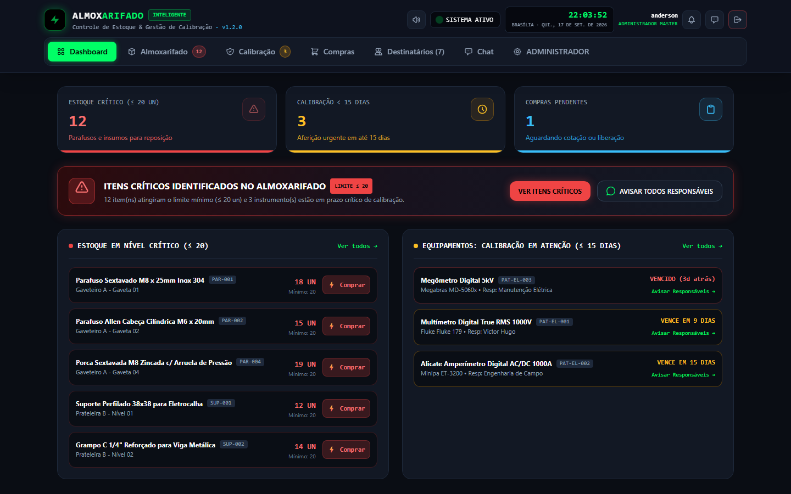
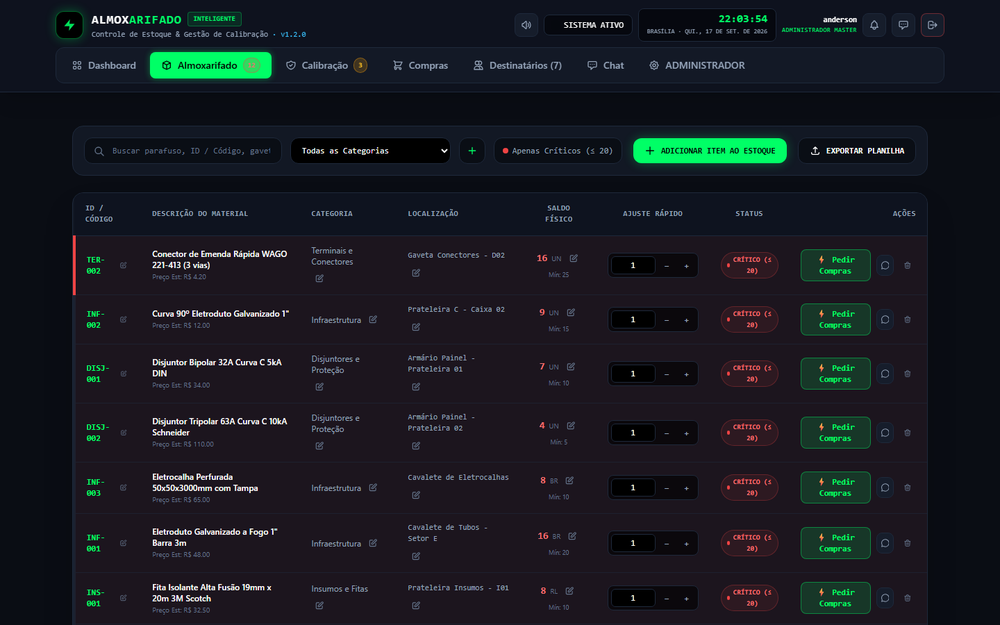
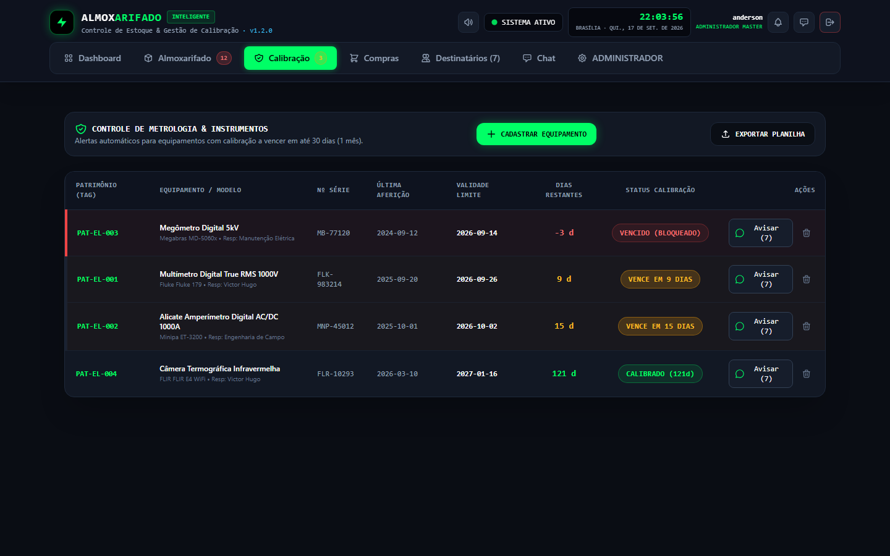
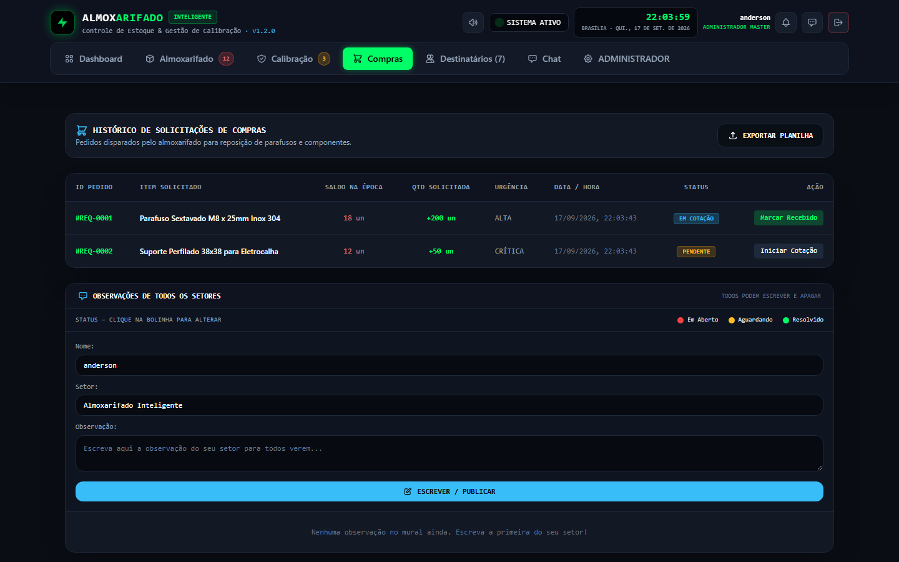
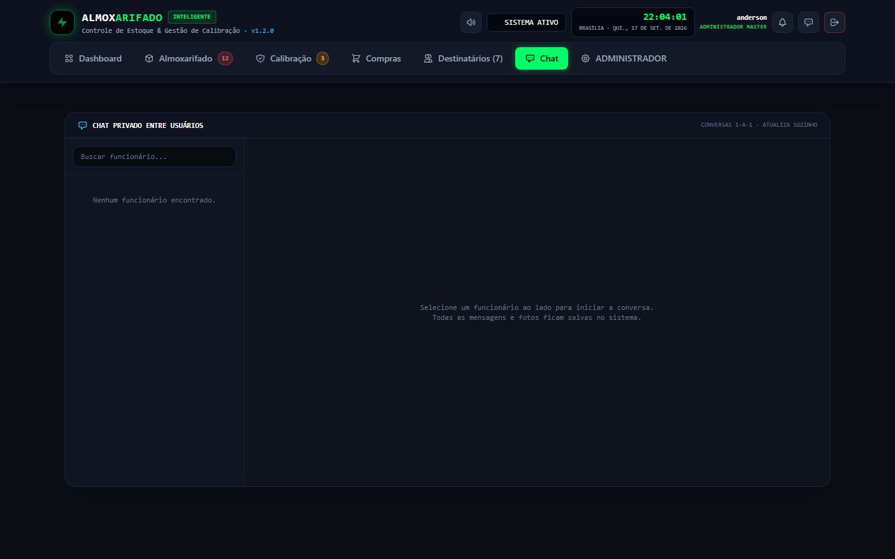
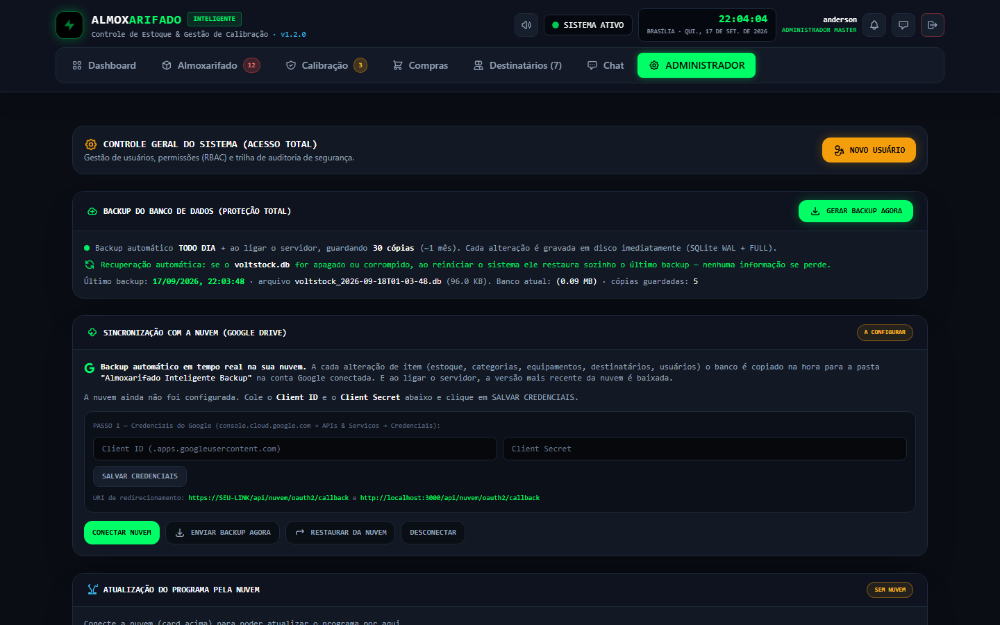

# 🏭 Almoxarifado Inteligente — Smart Inventory Management System

[](https://nodejs.org/)
[](https://expressjs.com/)
[](https://sqlite.org/)
[](LICENSE)
[](SECURITY.md)
[](https://github.com/VictorHugoEng/AlmoxarifadoProject/actions/workflows/ci.yml)

> A production-grade inventory ("almoxarifado") system built with **Node.js and SQLite**.
> Stock control, equipment calibration, purchase requests, private chat and a full audit
> trail — with **automatic cloud backup** (Google Drive) and **over-the-air updates**,
> designed for real industrial environments where **losing data is not an option**.

🇧🇷 [Leia em Português (BR)](README.pt-BR.md)

> ### ▶️ Live demo
>
> **[almoxarifado-inteligente.onrender.com](https://almoxarifado-inteligente.onrender.com)**
> — login `anderson` / password `demo-almox-2026`.
> Runs on a free Render instance: data resets when the service restarts.

---

## Screenshots

<table>
  <tr>
    <td width="50%"><br><sub><b>Dashboard</b> — key metrics and low-stock alerts</sub></td>
    <td width="50%"><br><sub><b>Inventory</b> — items, categories and critical-level alerts</sub></td>
  </tr>
  <tr>
    <td><br><sub><b>Calibration</b> — equipment and expiry tracking</sub></td>
    <td><br><sub><b>Purchase requests</b> — status workflow and buyer feedback</sub></td>
  </tr>
  <tr>
    <td><br><sub><b>Private chat</b> — 1-to-1 messages with attachments</sub></td>
    <td><br><sub><b>Admin</b> — users, roles, audit log and backups</sub></td>
  </tr>
</table>

## Why this project

This is not a tutorial clone — it is a **system running in production** for a small
industrial operation. It was built to solve real constraints:

- **No dedicated IT / no server budget** — it runs on an ordinary Windows PC.
- **Unreliable environments** — power/internet can drop, so the database is backed up
  locally _and_ to the cloud, and the system recovers automatically on boot.
- **Non-technical users** — the whole app is a PWA installed from a link on their phone.
- **Remote access** — users connect from outside the network over an HTTPS tunnel.

## Tech Stack

| Layer          | Technology                                                |
| -------------- | --------------------------------------------------------- |
| Runtime        | Node.js 22.13+ (CI on Node 24)                            |
| Web framework  | Express 5                                                 |
| Database       | SQLite via the built-in `node:sqlite` module (WAL mode)   |
| Authentication | scrypt password hashing + 256-bit Bearer session tokens   |
| Frontend       | Vanilla JS SPA + Service Worker (PWA), Tailwind CSS (CDN) |
| Cloud          | Google Drive API (OAuth 2.0) for backup & OTA updates     |
| Extras         | Optional LibreOffice microservice for PDF export          |
| Quality        | ESLint, Prettier, Husky, `node:test`, GitHub Actions CI   |

## Architecture

```
┌──────────────────────────────────────────────────────────────────┐
│                     CLIENT (Browser / PWA)                       │
│   Vanilla JS SPA + Service Worker (app-shell cache) + localStorage│
└───────────────────────────────┬──────────────────────────────────┘
                                │ HTTPS (HTTP polling)
                                ▼
┌──────────────────────────────────────────────────────────────────┐
│                    NODE.JS SERVER (Express 5)                    │
│  ┌───────────┐ ┌───────────┐ ┌───────────┐ ┌───────────────┐     │
│  │   Auth    │ │ Inventory │ │   Chat    │ │     Admin     │     │
│  └─────┬─────┘ └─────┬─────┘ └─────┬─────┘ └───────┬───────┘     │
│        └─────────────┴─────────────┴───────────────┘             │
│                              ▼                                    │
│          Middleware: Rate Limit → Auth → RBAC → Audit → Cloud    │
│                              ▼                                    │
│           SQLite (WAL + synchronous=FULL, ACID, auto-checkpoint) │
│                              ▼                                    │
│        Local backups (30 copies) · Google Drive · Boot recovery  │
└──────────────────────────────────────────────────────────────────┘
```

## Features

- **Inventory** — items, categories, low-stock alerts, filters and search.
- **Equipment & metrology** — calibration status and expiration tracking.
- **Purchase requests** — request workflow with status (`PENDING`, `QUOTING`, `FULFILLED`).
- **Private chat** — 1:1 conversations with image attachments and unread badges.
- **Admin & audit** — user/role management, password reset, account unlock, and a
  security audit log (logins, RBAC changes, sensitive CRUD, backups).
- **Cloud backup** — continuous sync to Google Drive + manual backup/restore.
- **Over-the-air updates** — new versions are published to Drive and applied from the
  admin panel; the server restarts itself while keeping data intact.
- **PWA** — installable on Android/iOS from the browser, with an offline app shell.

## Security

| Layer             | Implementation                                                               |
| ----------------- | ---------------------------------------------------------------------------- |
| **Passwords**     | scrypt key derivation (64-byte key, 16-byte random salt) + `timingSafeEqual` |
| **Sessions**      | 256-bit tokens (`crypto.randomBytes(32)`) with configurable expiry           |
| **Rate limiting** | Per route: login `10/min` (15-min block on abuse), API `120/min`             |
| **Brute force**   | Account lockout after `5` failed attempts for `15` minutes                   |
| **Headers**       | Strict CSP, HSTS, `X-Frame-Options`, `Permissions-Policy`                    |
| **Recovery**      | Automatic restore: local backup → cloud → fresh database                     |

## Quick Start

### Prerequisites

- **Node.js 22.13+** (Node 24 LTS recommended — `node:sqlite` is a built-in module)
- **npm 10+**

### Run locally

```bash
git clone https://github.com/VictorHugoEng/AlmoxarifadoProject.git
cd AlmoxarifadoProject
npm ci
npm start
# Server running at http://localhost:3000
```

### Default credentials (first run)

```
Username: anderson
Password: 123456      # local default
Role:     ADMIN_MASTER
```

> On the **live demo** the password is `demo-almox-2026` (set by `render.yaml` through
> `ALMOX_ADMIN_PASSWORD`). Locally the default is `123456`.
>
> ⚠️ **Change the password immediately after the first login.**

## Configuration

### Environment variables

| Variable               | Default               | Purpose                                                  |
| ---------------------- | --------------------- | -------------------------------------------------------- |
| `PORT`                 | `3000`                | HTTP port                                                |
| `HOST`                 | `127.0.0.1`           | Bind address (`0.0.0.0` in containers/PaaS)              |
| `ALMOX_DB_PATH`        | `./voltstock.db`      | Custom database path (also isolates boot-time recovery)  |
| `ALMOX_CONFIG_PATH`    | `./nuvem_config.json` | Custom Google Drive credentials file path                |
| `ALMOX_ADMIN_PASSWORD` | `123456`              | Initial admin password (first run only; change it)       |
| `ALMOX_NO_RECOVER`     | _(unset)_             | `1` disables boot-time recovery (used by isolated tests) |

Google Drive credentials are **not** environment variables — they are configured through
the admin UI and stored in `nuvem_config.json` (kept out of version control).

### Google Drive sync (production)

1. Go to the [Google Cloud Console](https://console.cloud.google.com/).
2. Create a project → **APIs & Services** → enable **Google Drive API**.
3. **Credentials** → **OAuth 2.0 Client ID** (Application type: _Web_).
4. Authorized redirect URI: `https://YOUR-DOMAIN/api/nuvem/oauth2/callback`.
5. In the app: **Admin → Cloud** → paste Client ID/Secret → **Connect**.

## API Reference

### Authentication

| Method | Endpoint      | Description                  |
| ------ | ------------- | ---------------------------- |
| `POST` | `/api/login`  | Login (rate limited: 10/min) |
| `GET`  | `/api/sessao` | Validate an active session   |
| `POST` | `/api/logout` | End the session              |

### Inventory

| Method   | Endpoint                  | RBAC         | Description                                          |
| -------- | ------------------------- | ------------ | ---------------------------------------------------- |
| `GET`    | `/api/estoque`            | All          | List items (`busca`, `categoria`, `apenas_criticos`) |
| `POST`   | `/api/estoque`            | OPERADOR+    | Create item                                          |
| `PUT`    | `/api/estoque/:id`        | OPERADOR+    | Update item                                          |
| `DELETE` | `/api/estoque/:id`        | ADMIN_MASTER | Delete item                                          |
| `GET`    | `/api/estoque/categorias` | All          | List categories                                      |
| `POST`   | `/api/estoque/categorias` | ADMIN_MASTER | Create category                                      |

### Equipment / Metrology

| Method   | Endpoint                | RBAC         | Description                  |
| -------- | ----------------------- | ------------ | ---------------------------- |
| `GET`    | `/api/equipamentos`     | All          | List with calibration status |
| `POST`   | `/api/equipamentos`     | OPERADOR+    | Create equipment             |
| `PUT`    | `/api/equipamentos/:id` | OPERADOR+    | Update                       |
| `DELETE` | `/api/equipamentos/:id` | ADMIN_MASTER | Delete                       |

### Purchases

| Method  | Endpoint                    | RBAC      | Description    |
| ------- | --------------------------- | --------- | -------------- |
| `GET`   | `/api/compras`              | All       | List requests  |
| `POST`  | `/api/compras`              | OPERADOR+ | Create request |
| `PATCH` | `/api/compras/:id/status`   | COMPRAS+  | Update status  |
| `PATCH` | `/api/compras/:id/feedback` | COMPRAS+  | Buyer feedback |

### Private chat

| Method | Endpoint                   | Description                            |
| ------ | -------------------------- | -------------------------------------- |
| `GET`  | `/api/chat/contatos`       | Contacts + last message + unread count |
| `GET`  | `/api/chat/:id`            | Conversation history                   |
| `POST` | `/api/chat/:id`            | Send message/image                     |
| `POST` | `/api/chat/:id/lidas`      | Mark as read                           |
| `GET`  | `/api/chat/naolidas/total` | Total unread badge                     |

### Admin / Audit

| Method   | Endpoint                        | RBAC         | Description                 |
| -------- | ------------------------------- | ------------ | --------------------------- |
| `GET`    | `/api/usuarios`                 | ADMIN_MASTER | List users                  |
| `POST`   | `/api/usuarios`                 | ADMIN_MASTER | Create user                 |
| `PUT`    | `/api/usuarios/:id`             | ADMIN_MASTER | Edit user/role/password     |
| `DELETE` | `/api/usuarios/:id`             | ADMIN_MASTER | Delete user                 |
| `POST`   | `/api/usuarios/:id/desbloquear` | ADMIN_MASTER | Unlock brute-forced account |
| `GET`    | `/api/auditoria`                | ADMIN_MASTER | Security logs (last 200)    |
| `POST`   | `/api/backup`                   | ADMIN_MASTER | Manual backup               |
| `GET`    | `/api/backup/status`            | ADMIN_MASTER | Backup status               |

### Cloud (Google Drive)

| Method | Endpoint               | RBAC         | Description         |
| ------ | ---------------------- | ------------ | ------------------- |
| `GET`  | `/api/nuvem/status`    | Public       | Connection status   |
| `GET`  | `/api/nuvem/login`     | Public       | Google OAuth        |
| `POST` | `/api/nuvem/config`    | ADMIN_MASTER | Save credentials    |
| `POST` | `/api/nuvem/enviar`    | ADMIN_MASTER | Upload backup now   |
| `POST` | `/api/nuvem/restaurar` | ADMIN_MASTER | Download from cloud |

### Over-the-air updates

| Method | Endpoint                   | RBAC         | Description            |
| ------ | -------------------------- | ------------ | ---------------------- |
| `GET`  | `/api/atualizacao/status`  | ADMIN_MASTER | Check remote version   |
| `POST` | `/api/atualizacao/aplicar` | ADMIN_MASTER | Apply update + restart |

## Testing & Quality

```bash
npm test           # Smoke tests (node:test)
npm run lint       # ESLint
npm run format:check  # Prettier
npm run audit      # npm audit (high severity)
```

The smoke suite (`test/smoke.test.js`) boots the real server against an **isolated
temporary database** and asserts the app shell loads plus the login/version endpoints
respond correctly. The same checks run in CI on every pull request.

## Project Structure

```
AlmoxarifadoProject/
├── server.js              # Entry point: routes + middleware pipeline
├── database.js            # SQLite schema, crypto, migrations, boot recovery
├── nuvem.js               # Google Drive OAuth + backup sync + version check
├── package.json
├── .github/
│   ├── workflows/ci.yml   # CI/CD pipeline
│   ├── ISSUE_TEMPLATE/    # Bug report, feature request
│   └── PULL_REQUEST_TEMPLATE.md
├── public/                # Frontend (PWA)
│   ├── index.html
│   ├── login.html
│   ├── app.js
│   ├── style.css
│   ├── sw.js              # Service Worker (app-shell cache)
│   └── manifest.webmanifest
├── test/
│   └── smoke.test.js      # Boot + login + version smoke test
├── docs/screenshots/      # Application screenshots
├── converte-para-pdf/     # Optional PDF microservice
└── backups/               # Local backups (gitignored)
```

## Deployment

### PM2 (recommended on a VPS)

```bash
npm install -g pm2
pm2 start server.js --name almoxarifado
pm2 startup
pm2 save
```

### One-click deploy (Render)

[](https://render.com/deploy?repo=https://github.com/VictorHugoEng/AlmoxarifadoProject)

The [`render.yaml`](render.yaml) blueprint provisions a free Node web service that sets
`HOST=0.0.0.0` and a demo admin password via `ALMOX_ADMIN_PASSWORD`. The free instance uses
an **ephemeral filesystem** — data resets on restart, which is exactly what you want for a
demo.

### Docker (any provider)

A ready-to-use [`Dockerfile`](Dockerfile) is included:

```bash
docker build -t almoxarifado .
docker run -d -p 3000:3000 -e ALMOX_ADMIN_PASSWORD=change-me almoxarifado
```

### systemd (Linux)

```ini
# /etc/systemd/system/almoxarifado.service
[Unit]
Description=Almoxarifado Inteligente
After=network.target

[Service]
Type=simple
User=almox
WorkingDirectory=/opt/almoxarifado
ExecStart=/usr/bin/node server.js
Restart=on-failure
Environment=NODE_ENV=production

[Install]
WantedBy=multi-user.target
```

## Contributing

1. Fork the project.
2. Create a branch: `git checkout -b feature/my-feature`.
3. Commit following **Conventional Commits** (`feat:`, `fix:`, `docs:`, `refactor:`, `test:`, `chore:`).
4. Push and open a Pull Request (CI must pass).

See [CONTRIBUTING.md](CONTRIBUTING.md) for details.

## License

MIT License — see [LICENSE](LICENSE).

## Author

**Victor Hugo** — Software Engineering student

- GitHub: [@VictorHugoEng](https://github.com/VictorHugoEng)
- LinkedIn: [victorhugoeng](https://linkedin.com/in/victorhugoeng)

---

> Built with an enterprise mindset for real production use.
> _Zero data loss. Zero downtime. Zero excuses._
